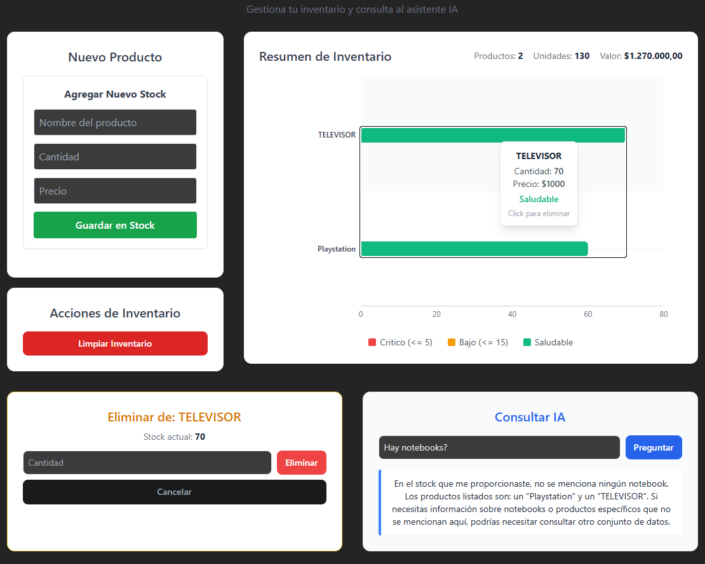

# 📦 AutoSync Dashboard


Sistema de **gestión de inventario inteligente** desarrollado con **React, Node.js, Express, Prisma y MySQL**, con integración de **Inteligencia Artificial** mediante **Groq + Llama 3.1 8B**.

Permite administrar productos, visualizar el estado del inventario en tiempo real y realizar consultas en lenguaje natural sobre los datos almacenados.

---

## 📸 Captura



---

# 🚀 Características

- ✅ Gestión de inventario mediante operaciones CRUD
- ✅ Dashboard interactivo con gráficos
- ✅ Colores dinámicos según nivel de stock
- ✅ Eliminación parcial o total de productos
- ✅ Persistencia de datos con MySQL
- ✅ Arquitectura Backend en capas
- ✅ Prisma ORM
- ✅ Docker Compose
- ✅ Integración con IA (Groq + Llama 3.1)
- ✅ API REST

---

# 🛠 Stack Tecnológico

## Frontend

| Tecnología | Uso |
|------------|-----|
| React 19 | UI |
| Vite | Bundler |
| Axios | Cliente HTTP |
| Recharts | Dashboard |
| Tailwind CSS | Estilos |

---

## Backend

| Tecnología | Uso |
|------------|-----|
| Node.js | Runtime |
| Express | API REST |
| Prisma ORM | Acceso a datos |
| MySQL | Base de datos |
| Groq SDK | IA |

---

# 🏛 Arquitectura

```
React
   │
Axios
   │
Express
   │
Controllers
   │
Services
   │
Prisma ORM
   │
MySQL

             │

      Groq API (Llama 3.1)
```

---

## Arquitectura Backend

```
routes
    │
controllers
    │
services
    │
Prisma Client
    │
MySQL
```

---

# 📂 Estructura

```
autosync-dashboard/

client/
server/

docker-compose.yml

README.md
```

---

# ⚙️ Requisitos

## Con Docker (Recomendado)

- Docker Desktop

## Sin Docker

- Node.js 18+
- MySQL
- API Key de Groq

---

# 🔑 Variables de entorno

Crear un archivo `.env` en la raíz del proyecto.

```env
GROQ_API_KEY=TU_API_KEY
DB_PASSWORD=TU_PASSWORD
```
> **Nota:** Si no definís `DB_PASSWORD`, Docker utilizará `autosync123` automáticamente.

---

# 🐳 Ejecutar con Docker

Clonar el repositorio

```bash
git clone https://github.com/matibulich/autosync_dash_IA.git

cd autosync_dash_IA
```

Construir las imágenes e iniciar los servicios

```bash
docker compose up -d --build
```

Servicios disponibles

| Servicio | Puerto |
|-----------|---------|
| Frontend | 3000 |
| Backend | 4000 |
| MySQL | 3307 |

Abrir en el navegador

```
http://localhost:3000
```

Ver logs

```bash
docker compose logs -f
```

Detener

```bash
docker compose down
```

Eliminar también la base de datos

```bash
docker compose down -v
```

---

# 💻 Ejecutar sin Docker

Backend

```bash
cd server

npm install

npx prisma migrate dev

npx prisma generate

npm run dev
```

Frontend

```bash
cd client

npm install

npm run dev
```

---

# 📡 Endpoints

| Método | Endpoint | Descripción |
|---------|----------|-------------|
| GET | /stock | Obtener productos |
| POST | /stock | Crear producto |
| DELETE | /stock | Eliminar inventario |
| POST | /stock/:id/reduce | Reducir stock |
| GET | /analyze | Consulta IA |

---

# 🧠 Integración con IA

Las consultas del usuario son enviadas al modelo:

**Llama 3.1 8B**

mediante la API de **Groq**.

El modelo recibe:

- Inventario completo
- Pregunta del usuario

y responde utilizando únicamente los datos almacenados.

---

# 🗄 Modelo de Datos

```prisma
model Stock {
  id        Int      @id @default(autoincrement())
  product   String   @unique
  amount    Float
  price     Float?
  date      DateTime @default(now())
}
```

---

# 📦 Docker

El proyecto utiliza tres contenedores.

```
client
│
├── React
│
server
│
├── Express
│
db
│
└── MySQL
```

Todo el entorno puede iniciarse mediante un único comando.

```
docker compose up -d --build
```

---

# 📜 Scripts

## Cliente

```
npm run dev
npm run build
npm run lint
```

## Servidor

```
npm run dev
npm start
npx prisma migrate dev
npx prisma generate
npx prisma studio
```

---

# 🛠 Solución de Problemas

## El puerto ya está ocupado

```bash
docker compose down
```

---

## Error con Prisma

```bash
docker compose down -v

docker compose up --build
```

---

## Error con Groq

Verificar que la variable

```
GROQ_API_KEY
```

sea válida.

---

## Error al conectar con MySQL

Verificar que el archivo `.env` contenga:

```env
DB_PASSWORD=tu_password
```

Si no se especifica, Docker utilizará

```
autosync123
```

---

# 📈 Posibles mejoras

- Autenticación JWT
- Roles de usuario
- Historial de movimientos
- Exportación CSV / Excel
- Dashboard con métricas
- Alertas automáticas de stock
- Deploy automático mediante CI/CD

---

# 👨‍💻 Autor

**Matías Bulich**

Full Stack JavaScript Developer

GitHub

https://github.com/matibulich

LinkedIn

https://www.linkedin.com/in/matias-bulich/

---

# 📄 Licencia

Proyecto desarrollado con fines educativos y como parte de mi portfolio profesional.

No se permite su redistribución comercial sin autorización del autor.
